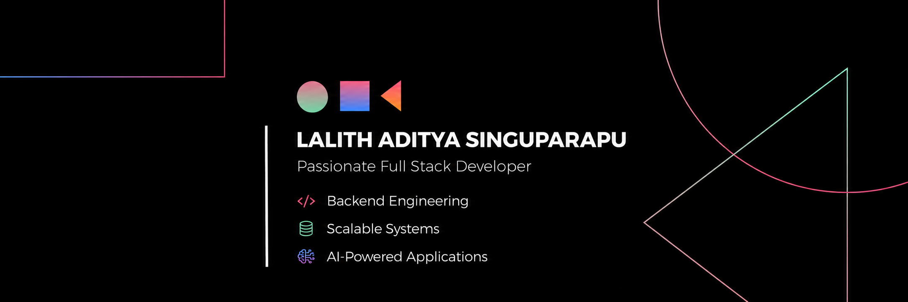

<!--Banner--> 

  

<!-- Hero -->

<h1 align="center">
Hi 👋, I'm Lalith Aditya
</h1>

I'm a Computer Science undergraduate passionate about building practical software that solves real-world problems. My primary focus is on backend engineering, full stack development, scalable architectures, and AI-powered applications. I enjoy transforming ideas into reliable products while continuously improving my problem-solving, system design, and software engineering skills.

<!-- Divider + Profile Views -->

  

---
<!--About Me--> 

<h2 align="center">🚀 ABOUT ME</h2>

- 🔭 Currently building **[BookMyCare](https://github.com/lalithdev/BookMyCare-Patient-Appointment-Booking-System)** - a scalable patient appointment booking platform
- 🌱 Learning **System Design, AWS, Scalable Backend Engineering, and AI Integrations**
- 💡 Interested in **Backend Systems, Full Stack Development, AI Products, and Cloud Architecture**
- ⚙️ Strong focus on **Spring Boot, PostgreSQL, REST APIs, JWT Authentication, and React**
- 🧠 Practicing **DSA and problem solving** regularly
- 🎯 Goal: Become a strong **Software Engineer & Backend Architect**
- 📫 Reach me at: **lalithadityasinguparapu@gmail.com**

---

<!--Tech Stack--> 

<h2 align="center">🛠️ TECH STACK </h2>

| Category | Skills |
|-----------|---------|
| **Programming Languages** |     |
| **Backend Development** |     |
| **Frontend Development** |     |
| **Databases** |   |
| **Cloud & DevOps** |     |
| **Developer Tools** |      |

---

<!--Github Stats--> 
<h2 align="center"> 📊 GITHUB STATS</h2>

<table>
<tr>
<td width="50%">

</td>
<td width="50%">

</td>
</tr>

<tr>
<td width="50%" align="center">

</td>
<td width="50%">

</td>
</tr>
</table>

---

<!--Top Repos
## 🚀 TOP REPOSITORIES

-->

<!--Connect with me--> 

<h2 align="center">🌐 CONNECT WITH ME</h2>

&nbsp;&nbsp;
&nbsp;&nbsp;
&nbsp;&nbsp;

<!--Footer-->

Building scalable products, solving real-world problems, and growing every day.

